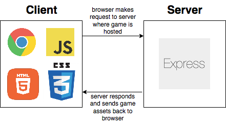
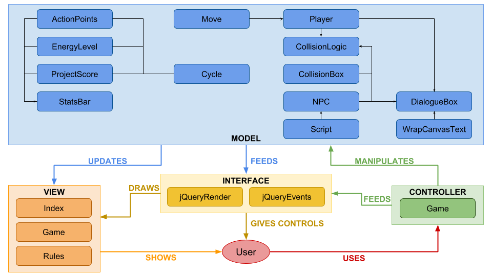

# Codecraft

## Introduction
Originally dubbed "Katsu to SpaceEx" (KTSE) as a project title, **Codecraft** is a strategic survival role playing game developed in pure vanilla JavaScript - with no game engines or frameworks. Codecraft is the Makers Academy final project developed by a team of 5 people: Tom Duffy, Julian Ng, Chris Ly, Charlene Bastians and Alfie Darko.

The focus of the project was to learn how to create a well-designed game, as opposed to focusing on learning new technology or coming out with a polished marketable product. In the end, we created a fully working game which has been deployed online via [Vercel](http://play-codecraft.co.uk) (and an [alternate link](https://ktse-14upug6xs-defc0none.vercel.app/) should the domain expire.

## Game Concept
Codecraft is a strategic survival simulation (SSS) game where players control the character, Ada, to complete an educational coding bootcamp to secure the best job possible. Each day, the player has a limited number of Action Points (AP) which depletes as they walk around, do project work, or engage with Non-Playable Characters (NPCs). When they do project work, their Project Score increases, which dictactes the job they get at the end of the game. When AP depletes to 0, the day ends and a new one begins - this transition will deplete their Energy Level (EL), which must remain above 0 otherwise the game is over.

## Tech Stack
* Primary Language: <del>C#</del> **Javascript**
* Test Framework: **Mocha, Chai, Zombie**
* Web Application Framework: **Express**

We made our decision to go with these technologies via:
* Online research
* Seeking advice from coaches
* Seeking advice from MA alumni
* Seeking advice from expert game developers

## Architecture Model

## Domain Model

## Project Approach

- Daily standups to assess the mood and prioritise what tasks need doing, distributing workload among ourselves
- Daily afternoon catch-ups to help with any blockers and check progress.
- Daily retros of what went well, what didn't go well, what we should start doing and stop doing
- Optionally, if anyone wanted to work beyond 'office hours', this would be communicated during the retro or via Slack. This was to prevent two people working independently on the same aspect
- Tasks and features were delegated to those who wanted to work on particular features, either as solo, pair or mob programming depending on the task and interest amongst the group.

## Project Kick Off
* Brainstorming (generated 6 ideas)
* Voting - round 1 (down-selected to 3 ideas)
* Define high-level MVP (improve understanding)
* Voting - round 2 (down-selected to 1 idea)
* Define overarching game concept (objective, features, high level mechanics)
* Refine MVP

## C# vs Javascript
When deciding what technologies we wanted to create our game in, we had an interesting segway at the start of our project to attempt to create our game in C#. Reasons for this included:

- C# is a popular language in the gamedev industry
- Availability of libraries and frameworks such as Unity and XNA/MonoGame
- The challenge of learning another language

However, after a day and a half of setting up our developer environment, we decided to make the move back to JavaScript as the software and utilities available to those using a Mac were immature compared to their Windows counterparts. Visual Studio also has UI differences between the two operating systems, causing further confusion as used tutorials as an aid to attempt to gain a foothold in making a start on the language.

We did manage to get sprites working and a game building and running successfully using the MonoGame framework - and some of our members are considering revisiting C# post-course on our Windows environments to work on a game as a side project.

## Project Management
- Communication: Slack
- Task management: Trello  
- Knowledge management: GitHub Wiki
